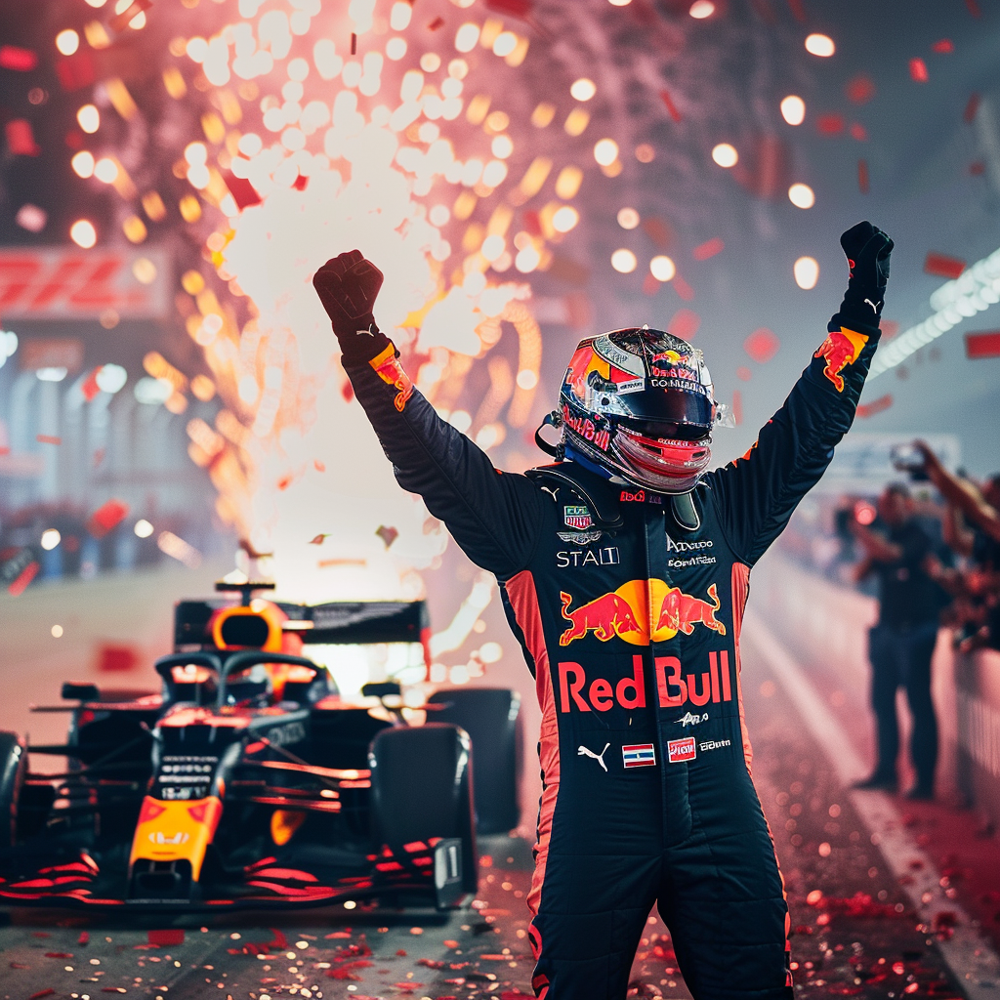

# f1_ml_project

## Formula 1 2024 Champion Prediction Project

A machine learning model that calculates what the results of the remaining 12 races will be with the data of Formula 1 races and fast laps held until July 2024.

## Data

### old_data

All data collected by manually and the data does not include weather and teams strategies.

The datas collected manually from (https://www.formula1.com/en.html)

## Scripts

Python's Pandas library scripts used in tidying data, modelling data, etc. Will likely be further differentiated in the future.
